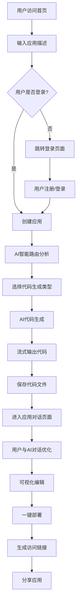
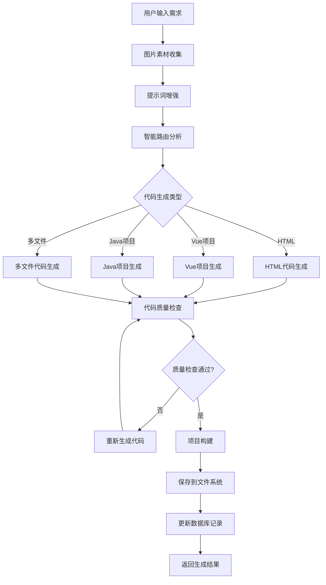
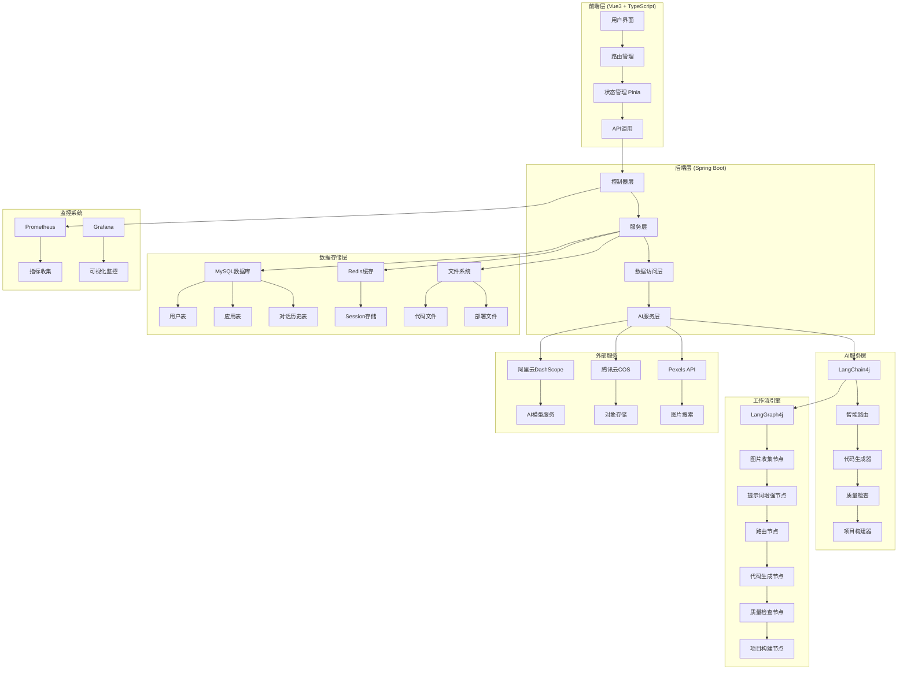
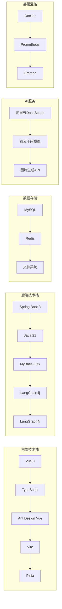
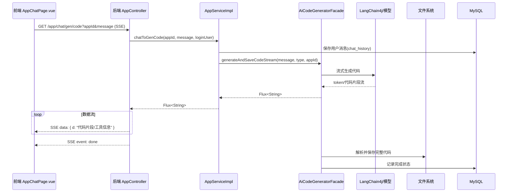
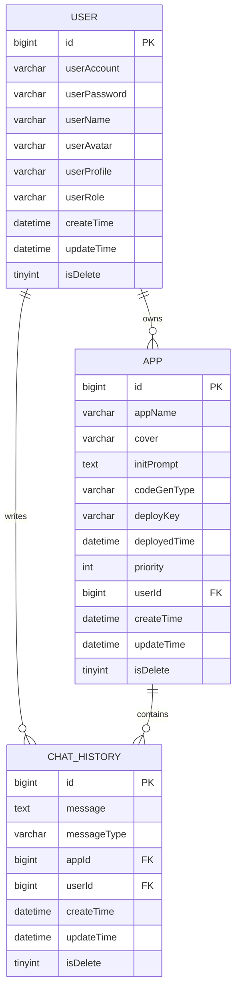
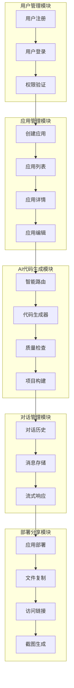

1）智能代码生成：用户输入需求描述，AI 自动分析并选择合适的生成策略，通过工具调用生成代码文件，采用流式输出让用户实时看到 AI 的执行过程。

2）可视化编辑：生成的应用将实时展示，可以进入编辑模式，自由选择网页元素并且和 AI 对话来快速修改页面，直到满意为止。

3）一键部署分享：可以将生成的应用一键部署到云端并自动截取封面图，获得可访问的地址进行分享，同时支持完整项目源码下载。

# 需求TODO
- 接入文档/图片分析模型,上传需求文档/图片和所需接口
- 将BSS和MG的服务抽成先抽成tool供AI使用.实现任务编排
- 开发BSS和MG的MCP服务,供模型使用,自主选择实现

## 项目流程图

### 用户使用流程

### AI代码生成工作流

## 系统架构图

### 整体架构

### 技术栈架构

### 生成代码 SSE 时序图

### 数据库 ER 图

### 核心模块关系图

