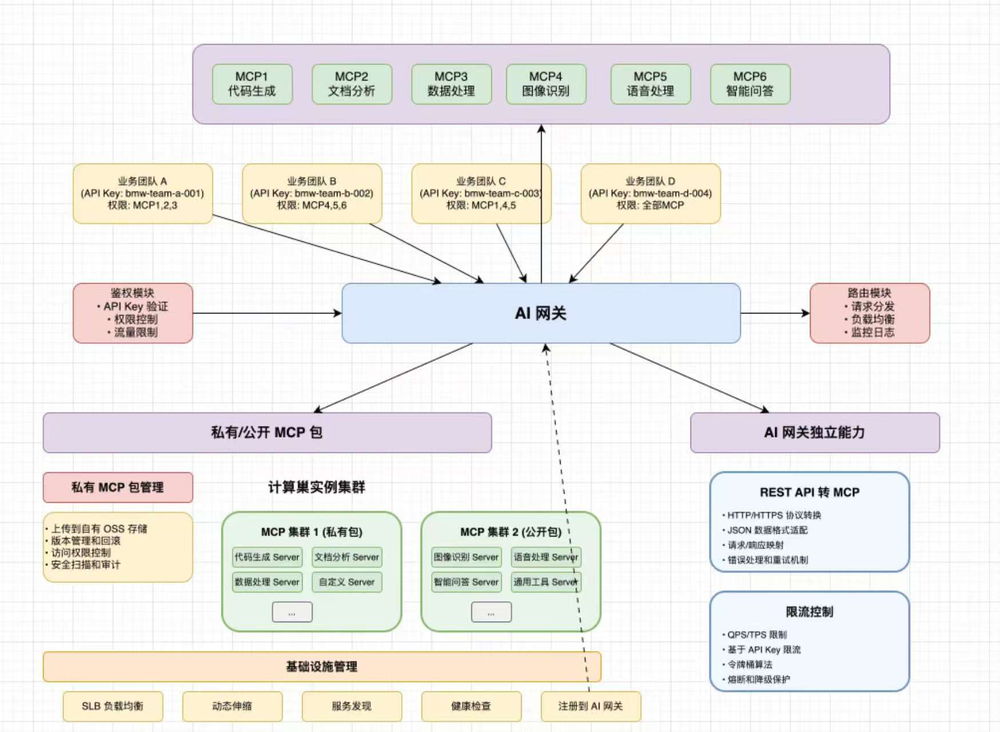

1）智能代码生成：用户输入需求描述，AI 自动分析并选择合适的生成策略，通过工具调用生成代码文件，采用流式输出让用户实时看到 AI 的执行过程。

2）可视化编辑：生成的应用将实时展示，可以进入编辑模式，自由选择网页元素并且和 AI 对话来快速修改页面，直到满意为止。

3）一键部署分享：可以将生成的应用一键部署到云端并自动截取封面图，获得可访问的地址进行分享，同时支持完整项目源码下载。

# 需求TODO
* 1. 接入文档/图片分析模型,上传需求文档/图片和所需接口
* 2. 接入公司的jenkins 实现打包部署一体流程
* 3. 梳理公司内部系统提供开发 MCP service服务.
* 4. 自动测试,验证修改.

